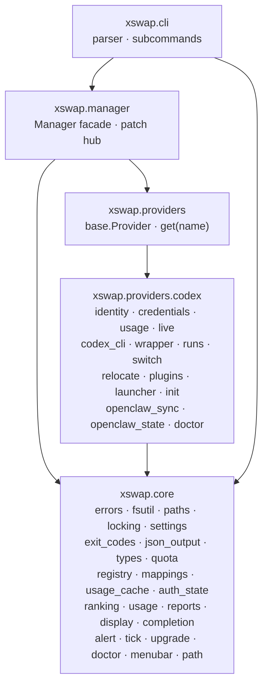

# Architecture

xswap switches which account a locally installed AI coding tool runs as. Today
the only tool it knows is Codex CLI (plus the Codex desktop app and a local
OpenClaw install). Everything that is *not* specific to Codex — the account
registry, the switching policy, the presentation, the diagnostics framework —
lives in a neutral core, so adding a second platform means adding a package,
not editing the existing one.

## The four layers



Imports point **down only**: `core <- providers <- manager <- cli`. `core`
never imports `xswap.providers`, `xswap.manager` or `xswap.cli` at import time,
and it never contains a platform's vocabulary. Both rules are tests, not
conventions — see `tests/test_import_graph.py::ProviderBoundary`.

The two exceptions, both deliberate:

* `xswap.core.paths` names `CODEX_SWAP_HOME` and `~/.local/share/codex-swap`.
  Those are on users' disks and in users' shell profiles; renaming either would
  move every installed state root and orphan every registered account. They are
  the doc-commented allow-list the boundary test carries.
* A handful of core functions reach a provider *at call time* through
  `manager.provider` (or `providers.get()` when a caller has no manager). That
  is a runtime edge, not an import edge, and it is how `list`, `tick`,
  `dashboard` and `upgrade` get the parts only a platform can supply.

## The `Provider` protocol

`xswap/providers/base.py` is a `typing.Protocol`: an implementation satisfies it
by having the members, so no provider module has to import it and a test double
is a plain object (`tests/fakes/provider.py`).

| member | what it answers |
| --- | --- |
| `name`, `home_label` | registry key; what this platform's home is called in messages core composes |
| `capabilities` | `live_switch`, `desktop_app`, `path_wrapper`, `per_account_home`, `openclaw_sync` |
| `quota_shape` | a `QuotaShape`: which bucket carries the quota, and the two window lengths |
| `identity(home)` → `Identity` | the local, unverified label for a login |
| `credential_state(home)` → `CredentialState` | `ok` / `sign_in_required` / `unreadable`, with a reason |
| `account_home(root, name)`, `prepare_home(...)` | where a managed account lives and what makes a fresh one usable |
| `read_usage(manager, home, ...)` → `UsageSnapshot` | one live quota read, normalized |
| `activate` / `login` / `launch` / `switch_running` | make an account the default, sign in, run the CLI, move running sessions |
| `status_data` / `bridge_hints` / `session_hints` / `credit_lines` | what the neutral list, dashboard and upgrade views cannot know |
| `doctor_checks(manager)` → `Iterable[Check]` | read-only diagnostics |

**Core branches on capabilities, never on `provider.name`.** A platform that
gains or loses a surface changes one frozenset; every caller follows.

The types that cross the boundary are all in `xswap/core/types.py`:
`QuotaShape`, `UsageWindow`, `UsageSnapshot`, `Identity`, `CredentialState`,
`Check`. Platform-specific data rides in `UsageSnapshot.extras`, which core
carries but never interprets.

## State on disk

Everything lives under one root — `$CODEX_SWAP_HOME`, or
`~/.local/share/codex-swap`:

```
<root>/accounts.json      registry: name -> {home, managed, provider, disabled}, plus `active` and `mappings`
<root>/auto.json          automatic-switching settings: pool, wrapper record, weekly reserve
<root>/usage-cache.json   last normalized quota per account, with the identity label it was read under
<root>/auth-state.json    per-account record of a usage-service rejection
<root>/.lock              the one lock file; exactly one acquisition per read-modify-write
<root>/profiles/<name>/   a managed account's per-platform homes (Codex: `.../codex`)
<root>/auto/              live-bridge runtime; `auto/cli-runs/<id>/` is one wrapped CLI run
```

`accounts.json` records carry `"provider"` from 0.8.3 on. It is written when a
record is **created**; records written earlier have no field and are read as
this build's provider. There is no migration — a read-only command must never
rewrite the registry.

## How the live bridge switches an account

Only providers with the `live_switch` capability have this. For Codex:

1. `xswap-codex` (the PATH wrapper, `providers/codex/wrapper.py`) execs the real
   `codex` with `CODEX_HOME` pointed at the selected account's profile and the
   bridge inserted as the app server's remote endpoint.
2. `providers/codex/live.py` proxies the app-server protocol. At **turn start**
   it reads the pool's quota and, if the current account is spent, rewrites the
   credentials the next turn uses — the session keeps its thread.
3. A manual `xswap use`/`switch` writes the registry selection and then
   broadcasts to the run records under `<root>/auto/` (`providers/codex/switch.py`).
   A bridge mid-turn records the request and applies it when the turn finishes.
4. `xswap auto-tick` (`core/tick.py`) is the between-sessions path: fetch quota,
   `decide(...)` against the weekly reserve, then select through the same
   compare-and-set `use` the CLI uses and broadcast through the provider.

`core/tick.py` knows none of that. It asks for a decision over rows and a
`QuotaShape`, and calls `manager.provider.switch_running(...)` to apply it.

## Adding a provider

1. Create `src/xswap/providers/<name>/` with a `provider.py` exposing a class
   that satisfies `base.Provider`, and whatever modules its platform needs.
   Import `xswap.core` freely; never import `xswap.core` *into* core.
2. Declare only the capabilities you really implement. A platform with no live
   bridge simply omits `live_switch`; nothing in core has to learn about it.
3. Give it a `QuotaShape` naming its quota bucket and its two window lengths.
   Do not put those numbers in core.
4. Register it in `xswap/providers/__init__.py::_PROVIDERS`.
5. Write its `doctor_checks`. The framework (statuses, formatting, exit code)
   is already in `core/doctor.py`.
6. Point `tests/fakes/provider.py` at it, or copy the pattern: the boundary
   tests in `tests/test_provider_boundary.py` drive core with a platform that
   is deliberately *not* Codex, which is what proves core stayed neutral.

Nothing in `xswap/core/` should need to change.

## Patchability

`xswap.manager` is the patch hub: `Manager`'s collaborators reach names like
`read_limits`, `identity` and `check_file_store` through `_Hooks`, which
resolves them in `xswap.manager`'s namespace at call time, so
`patch("xswap.manager.read_limits")` still bites wherever the work now lives.
The provider does the same — `CodexProvider.read_usage` goes through
`manager._hooks`, and `status_data`/`bridge_hints` resolve through
`xswap.providers.codex.codex_cli` with a function-local import, which is the
same late-lookup rule `wrapper._late` uses.

Every module that moved in INT-5614 is still importable under its old flat name
(`xswap.usage`, `xswap.live`, `xswap.doctor`, ...). Those are **aliases, not
re-exports**: `src/xswap/<name>.py` installs the moved module object under the
old key in `sys.modules`, so the two names are the same object and a patch
through either reaches the other. They are kept for one release.
